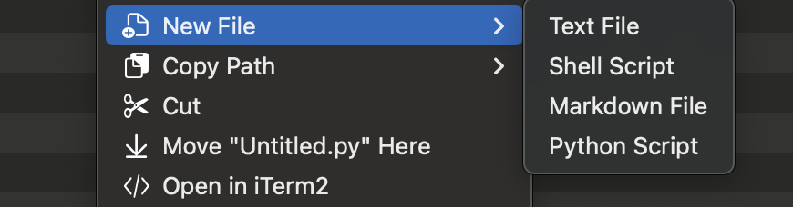
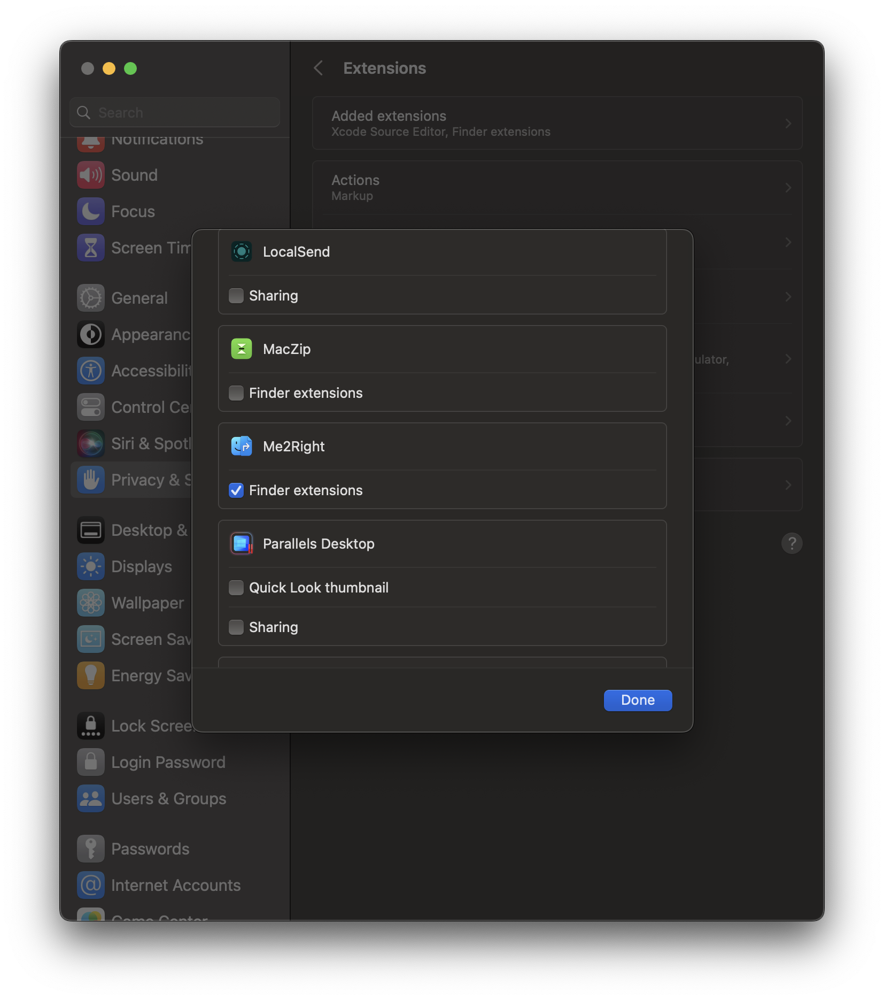

# Me2Right 

A lightweight plugin to add right-click file creation in Finder.

学习下 Finder Sync Extension 的工作原理，目前只实现Finder右键-新建文本文件，其它还在规划中。

## Features
Create new text files  
More features under planning 

### Screenshots

|  |  |
|-------------------------------------------------|--------------------------------------------------|
